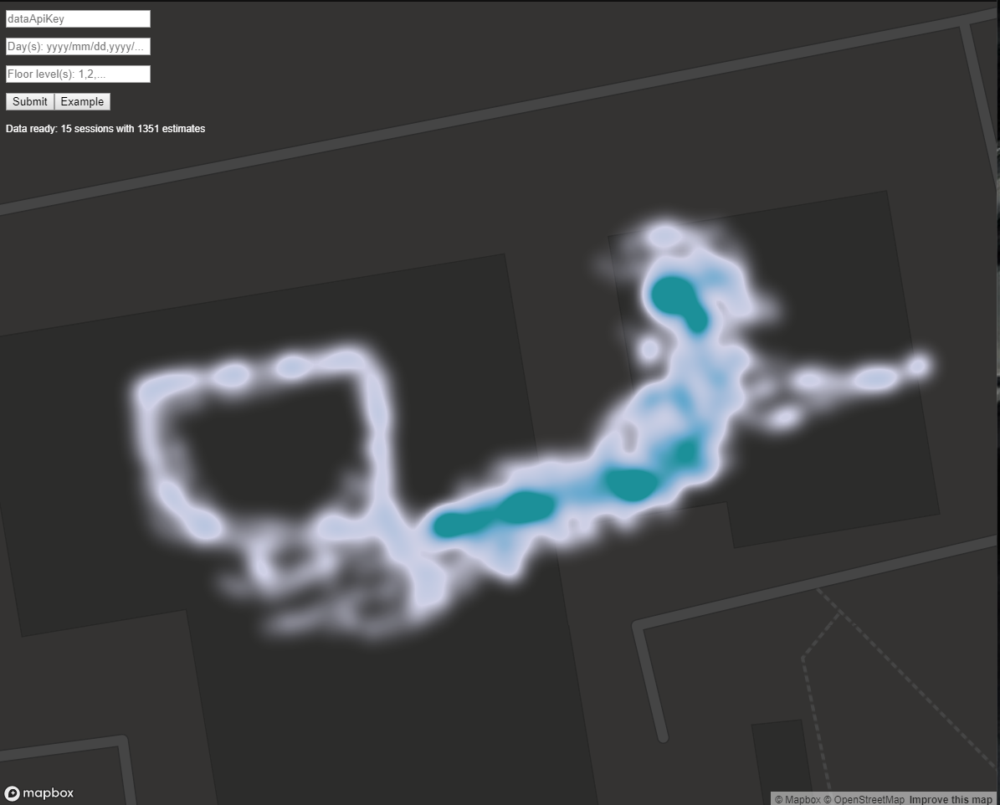

# Heatmap visualization using IndoorAtlas Data API and Scala.js

 
This project implements a simple web service that can be used to visualize IndoorAtlas session data for
a given account, dates and floor levels.
It demonstrates how
 * IndoorAtlas [Data API](https://indooratlas.freshdesk.com/support/solutions/articles/36000086507-data-rest-api-overview)
  can be used to fetch the session data, based on Data API key and given dates
 * The data can be used with heatmap visualization libraries, such as 
 [MapBox GL JS](https://docs.mapbox.com/mapbox-gl-js/api/)

## Live demo
Visualise your own user data or use an example visualization 
[here](https://indooratlas.github.io/scala-js-heatmap/target/scala-2.12/classes/index.html "Live demo").

## Related content
* IndoorAtlas Data REST [API Overview](https://indooratlas.freshdesk.com/support/solutions/articles/36000086507-data-rest-api-overview)
(with examples) and [API Reference](https://docs.indooratlas.com/data-api)
* MapBox GL JS [API](https://docs.mapbox.com/mapbox-gl-js/api/) and 
[Heatmap tutorial](https://docs.mapbox.com/help/tutorials/make-a-heatmap-with-mapbox-gl-js/)
* Scala.js [home page](https://www.scala-js.org/) and [tutorial](http://www.lihaoyi.com/hands-on-scala-js/)

## Building and running locally
 * Install [sbt 1.3.0](https://www.scala-sbt.org/download.html)
 * Run sbt from command line in the project root
   * Should automatically resolve all dependencies
   * Build using `sbt fastOptJS` or `fastOptJS` (in sbt console)
     * For production, use `fullOptJS` and change `resources/index.html` dependency accordingly
   * Use `~fastOptJS` for automatic build with code changes (e.g. when using an IDE) and refresh the page when done
 * Open `target/scala_2.12/classes/index.html` in a browser
   * Fill the fields and submit
   * Use Example button for fixed demo query config
 
## Possible future improvements
* Make the project cross compile to JS and JVM
  * command line + save to local json file for JVM
  * src folders already reflect this