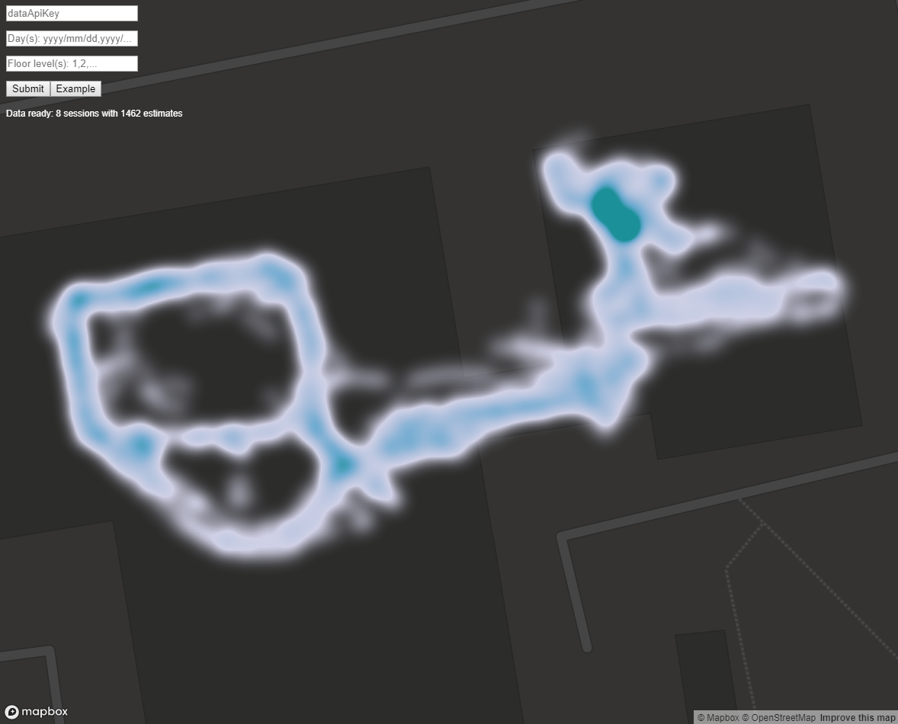

# Heatmap visualization using IndoorAtlas Data API and Scala.js

 
This project demonstrates how
 * IndoorAtlas Data Api can be used to fetch the session data, based on Data API key and given dates
 * The data can be used with heatmap visualization libraries (MapBox in this case)

The end result is a simple web service that can be used to visualize IndoorAtlas session data.

## Live demo
Visualise your own user data here (TODO).

## Building and running
 * Install [sbt 1.3.0](https://www.scala-sbt.org/download.html)
 * Run sbt from command line in the project root
   * Should automatically resolve all dependencies
   * Build using `fastOptJS` (in sbt console)
     * For production use `fullOptJS` and change `resources/index-dev.html` accordingly
   * Use `~fastOptJS` for automatic build with code changes (e.g. when using an IDE) and refresh the page when done
 * Open `target/scala_2.12/classes/index-dev.html` in a browser
   * Fill the fields and submit
   * Use Example button for fixed demo query config
 

## TODO
* Make the project cross compile to JS and JVM
  * command line + save to local json file for JVM
  * src folders already reflect this